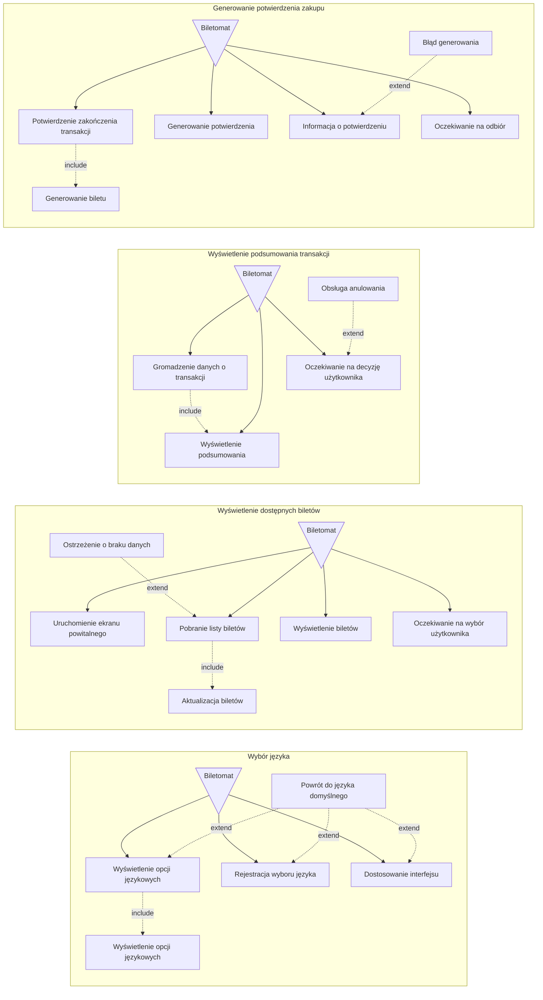
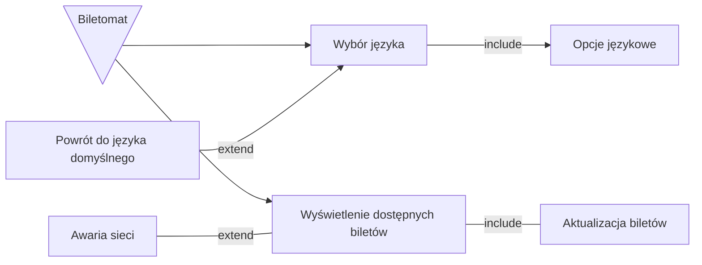

1. **Jako biletomat**, chcę automatycznie aktualizować listę dostępnych biletów i ich cen, aby zapewnić zgodność z polityką przewoźnika.
1. **Jako biletomat**, chcę rejestrować wszystkie transakcje i wysyłać raporty do systemu centralnego, aby umożliwić monitoring i kontrolę operacji.
1. **Jako biletomat**, chcę posiadać czytelny ekran dotykowy, aby użytkownik mógł 
łatwo nawigować po interfejsie.
2. **Jako biletomat**, chcę być wyposażony w różne metody płatności (terminal kart, czytnik gotówki, NFC), aby obsługiwać różnorodne transakcje.
3. **Jako biletomat**, chcę wydawać resztę w gotówce, jeśli użytkownik zapłaci 
nadmiarowo, aby transakcja była zgodna z oczekiwaniami.

## Diagram przypadków użycia

## Wspólny diagram

