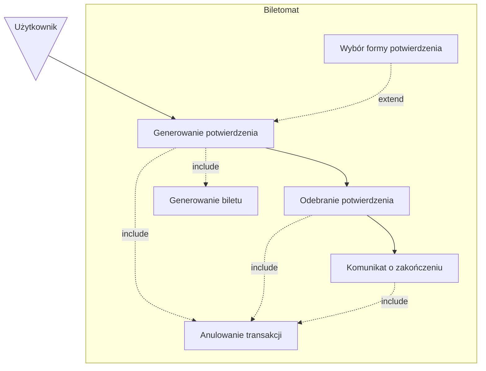
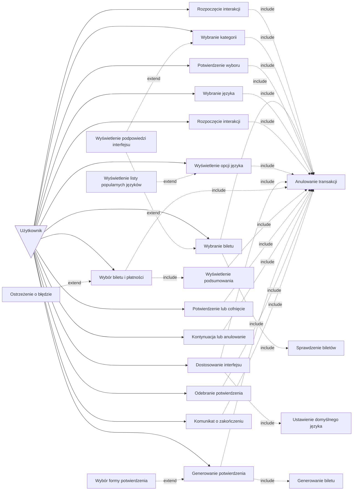
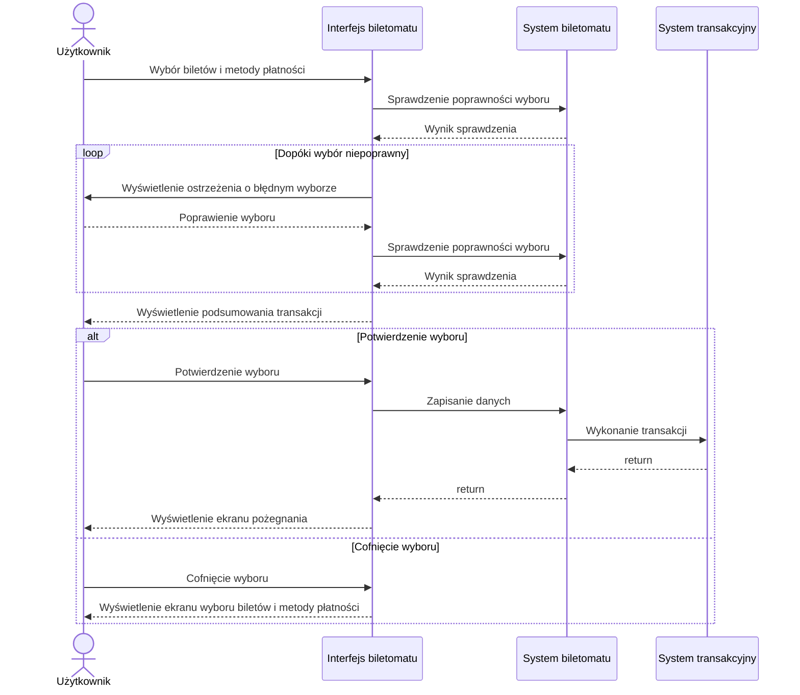

# User Stories

1. **Jako użytkownik**, chcę szybko wybrać rodzaj biletu, aby zminimalizować czas spędzony przy biletomacie.
1. **Jako użytkownik**, chcę mieć możliwość wyboru języka, aby móc korzystać z biletomatu bez względu na znajomość języka lokalnego.
1. **Jako użytkownik**, chcę sprawdzić poprawność transakcji przed jej finalizacją, aby uniknąć pomyłek.
1. **Jako użytkownik**, chcę otrzymać potwierdzenie zakupu (np. wydruk biletu lub elektroniczny bilet), aby móc korzystać z transportu zgodnie z przepisami.
1. **Jako użytkownik**, chcę płacić za bilet kartą, gotówką lub telefonem, aby mieć większą elastyczność w wyborze metody płatności.
2. **Jako użytkownik**, chcę otrzymać wyraźne instrukcje na ekranie, aby wiedzieć, jak dokonać zakupu krok po kroku.
3. **Jako użytkownik**, chcę widzieć czas pozostały na decyzję (np. wyświetlany 
licznik czasu), aby móc szybko podjąć działanie.

# Diagramy przypadków użycia

## 1. Szybki wybór rodzaju biletu

## 2. Wybór języka

## 3. Sprawdzenie poprawności transakcji

## 4. Otrzymanie potwierdzenia zakupu

### Wspólny diagram przypadków użycia

# Diagramy sekwencji

## Diagram sekwencji dla przypadku użycia sprawdzenia poprawności transakcji

- Aktor: Użytkownik
- Obiekty: Interfejs biletomatu, System biletomatu, System transakcyjny
- Kolejność komunikatów:
  1. Użytkownik wybiera bilety i metodę płatności
  2. System biletomatu weryfikuje poprawność wyboru
  4. Interfejs biletomatu wyświetla podsumowanie transakcji
  5. Użytkownik sprawdza szczegóły i potwierdza wybór
  6. System biletomatu zapisuje dane transakcji
  7. System transakcyjny dokonuje transakcji
- Scenariusz alternatywny 1 (Niepoprawny wybór)
  1. Użytkownik wybiera bilety i metodę płatności
  2. System biletomatu wykrywa niepoprawny wybór
  4. Interfejs biletomatu wyświetla ostrzeżenie o błędnym wyborze
  5. Użytkownik poprawia wybór
  2. System biletomatu weryfikuje poprawność wyboru
  4. Interfejs biletomatu wyświetla podsumowanie transakcji
  5. Użytkownik sprawdza szczegóły i potwierdza wybór
  6. System biletomatu zapisuje dane transakcji
  7. System transakcyjny dokonuje transakcji
  8. Interfejst biletomatu wyświetla ekran pożegnania
- Scenariusz alternatywny 2 (Cofnięcie wyboru)
  1. Użytkownik wybiera bilety i metodę płatności
  2. System biletomatu weryfikuje poprawność wyboru
  4. Interfejs biletomatu wyświetla podsumowanie transakcji
  5. Użytkownik sprawdza szczegóły i cofa wybór
  6. Interfejs biletomatu wyświetla ekran wyboru biletów i metody płatności
 

 
## Wizualizacja diagramu sekwencji

