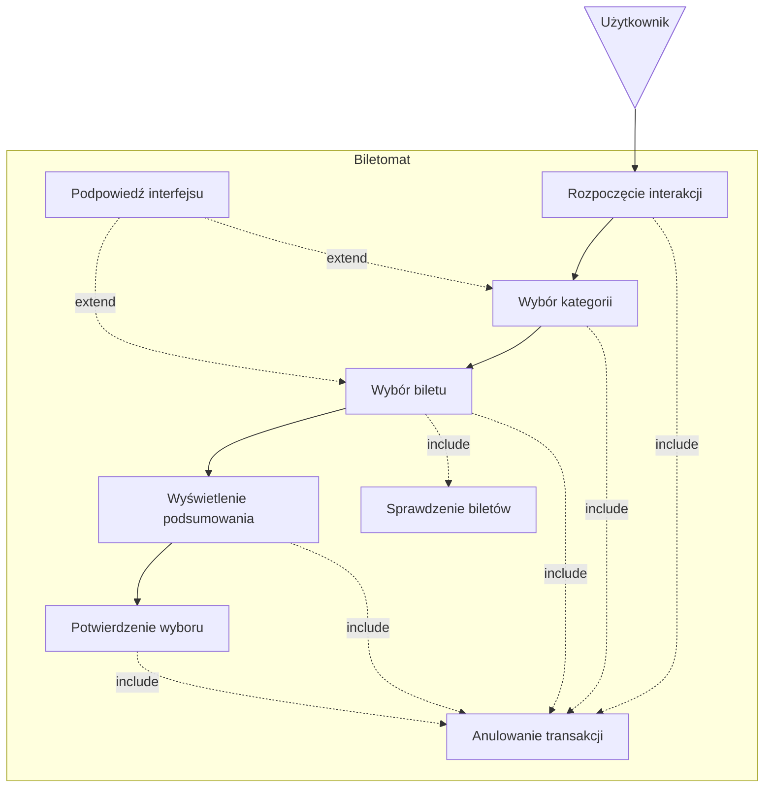
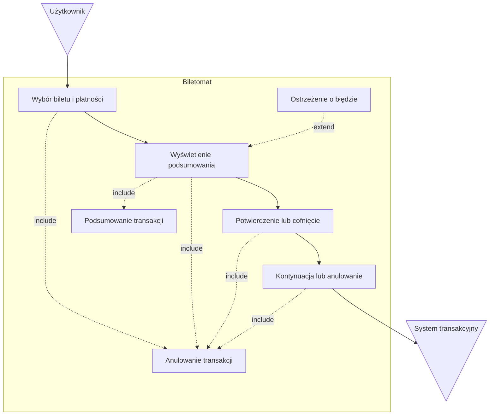
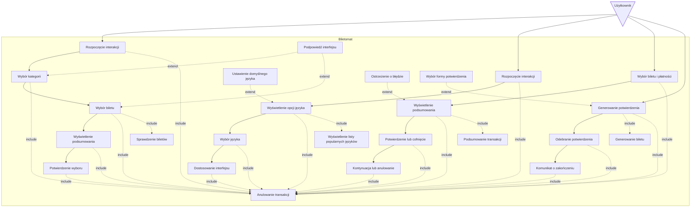
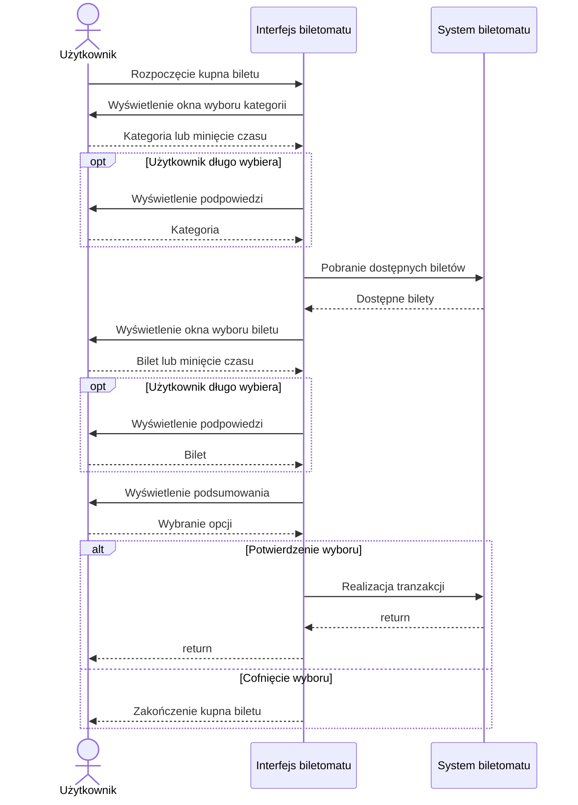
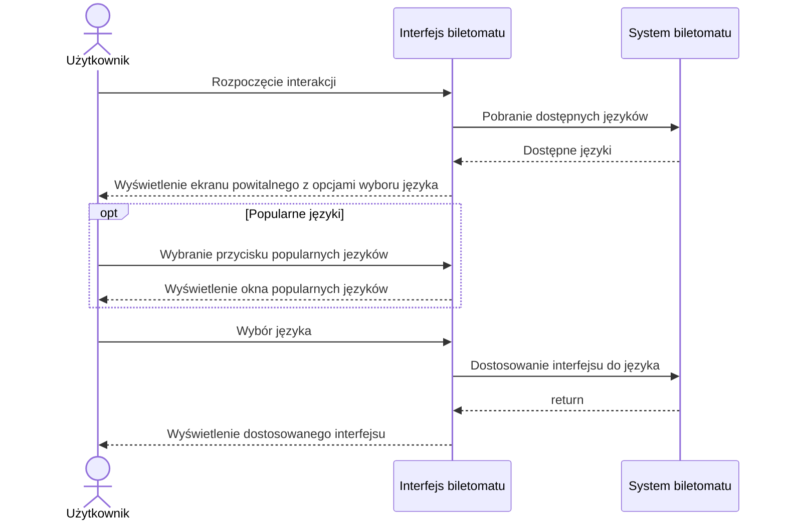
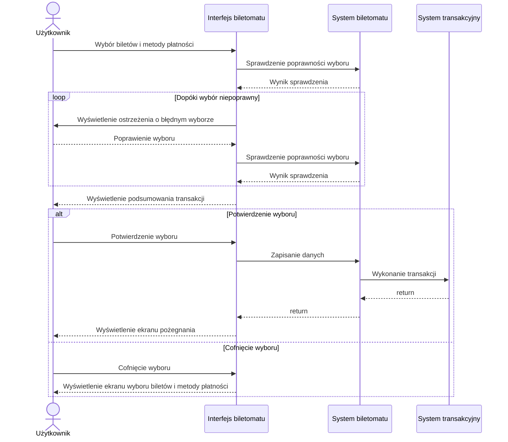
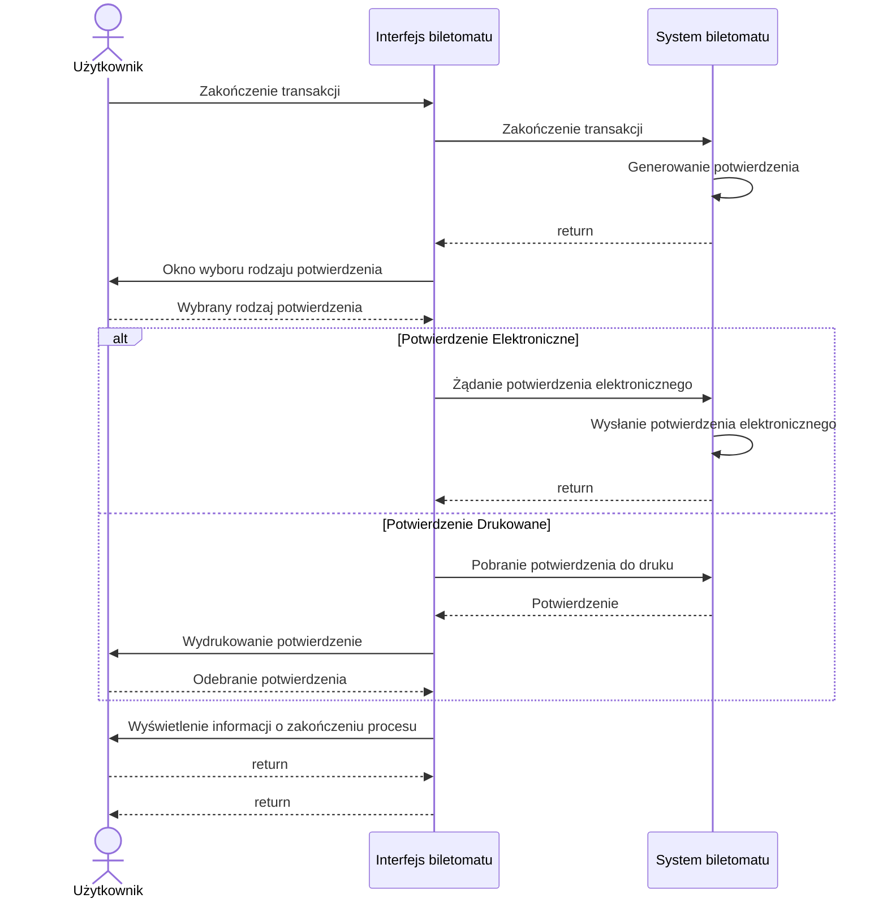
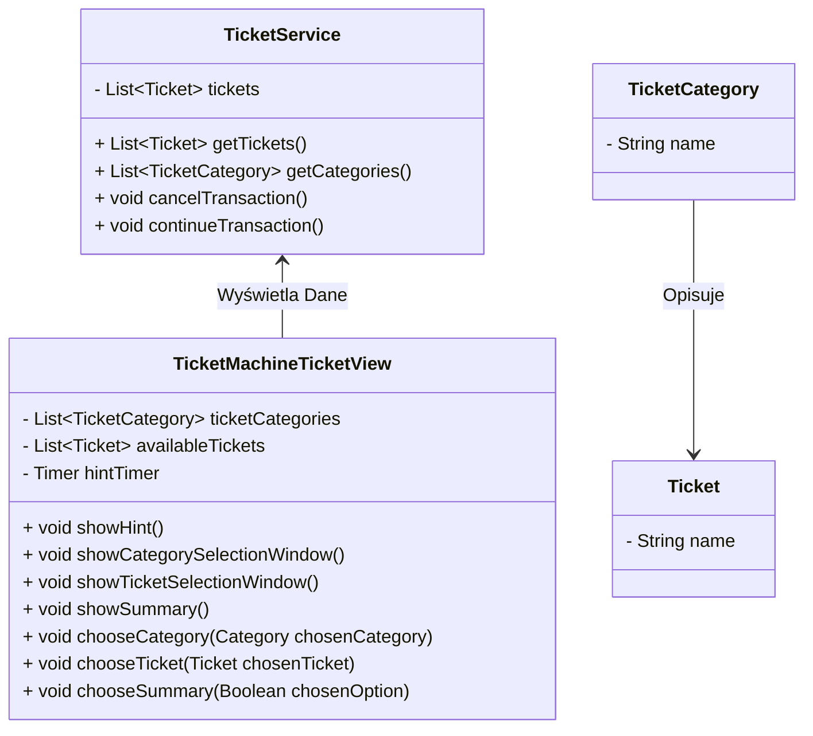
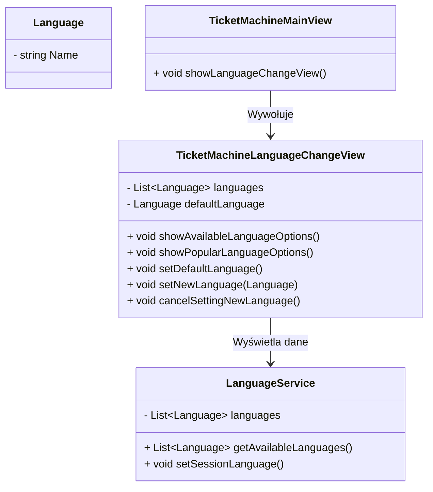
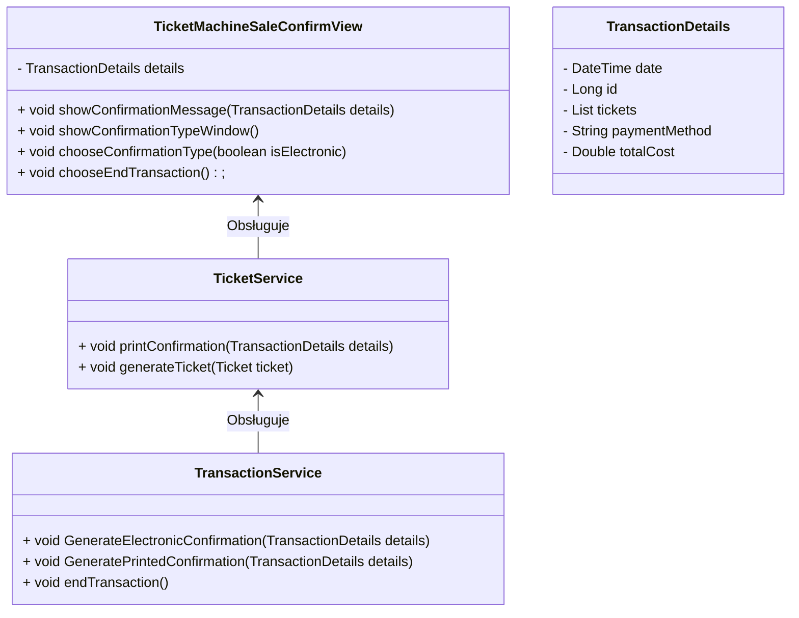

# User Stories

1. **Jako użytkownik**, chcę szybko wybrać rodzaj biletu, aby zminimalizować czas spędzony przy biletomacie.
1. **Jako użytkownik**, chcę mieć możliwość wyboru języka, aby móc korzystać z biletomatu bez względu na znajomość języka lokalnego.
1. **Jako użytkownik**, chcę sprawdzić poprawność transakcji przed jej finalizacją, aby uniknąć pomyłek.
1. **Jako użytkownik**, chcę otrzymać potwierdzenie zakupu (np. wydruk biletu lub elektroniczny bilet), aby móc korzystać z transportu zgodnie z przepisami.
1. **Jako użytkownik**, chcę płacić za bilet kartą, gotówką lub telefonem, aby mieć większą elastyczność w wyborze metody płatności.
2. **Jako użytkownik**, chcę otrzymać wyraźne instrukcje na ekranie, aby wiedzieć, jak dokonać zakupu krok po kroku.
3. **Jako użytkownik**, chcę widzieć czas pozostały na decyzję (np. wyświetlany 
licznik czasu), aby móc szybko podjąć działanie.

# Diagramy przypadków użycia

## 1. Szybki wybór rodzaju biletu

## 2. Wybór języka

## 3. Sprawdzenie poprawności transakcji

## 4. Otrzymanie potwierdzenia zakupu

### Wspólny diagram przypadków użycia

# Diagramy sekwencji

## Diagram sekwencji dla przypadku użycia Szybki wybór rodzaju biletu

- Aktor: Użytkownik
- Obiekty: Interfejs biletomatu, System biletomatu, System transakcyjny
- Kolejność komunikatów:
  1. Użytkownik klika w dowolne miejsce w biletomacie
  2. Interfejs wyświetla okno wyboru kategorii biletu
  1. Użytkownik wybiera kategorię biletu
  2. Interfejs pobiera listę dostępnych biletów
  3. Interfejs wyświetla listę biletów
  4. Użytkownik wybiera bilet
  5. Interfejs wyświetla podsumowanie
  6. Użytkownik potwierdza wybór
- Scenariusz alternatywny 1 (Cofnięcie  wyboru)
  1. Użytkownik klika w dowolne miejsce w biletomacie
  2. Interfejs wyświetla okno wyboru kategorii biletu
  1. Użytkownik wybiera kategorię biletu
  2. Interfejs pobiera listę dostępnych biletów
  3. Interfejs wyświetla listę biletów
  4. Użytkownik wybiera bilet
  5. Interfejs wyświetla podsumowanie
  6. Użytkownik anuluje wybór
  7. Interfejs wyświetla ekran główny
- Scenariusz alternatywny 2 (Długie oczekiwanie)
  1. Użytkownik klika w dowolne miejsce w biletomacie
  2. Interfejs wyświetla okno wyboru kategorii biletu
  3. Użytkownik długo oczekuje
  4. Interfejs wyświetla podpowiedź
  1. Użytkownik wybiera kategorię biletu
  2. Interfejs pobiera listę dostępnych biletów
  3. Interfejs wyświetla listę biletów
  3. Użytkownik długo oczekuje
  4. Interfejs wyświetla podpowiedź
  5. Użytkownik wybiera bilet
  6. Interfejs wyświetla podsumowanie
  7. Użytkownik potwierdza wybór

## Diagram sekwencji dla przypadku użycia wybrania języka

- Aktor: Użytkownik
- Obiekty: Interfejs biletomatu, System biletomatu
- Kolejność komunikatów:
  1. Użytkownik klika w dowolne miejsce na interfejsie biletomatu
  2. Interfejs biletomatu pobiera dostępne języki z systemu
  3. Interfejs biletomatu wyświetla ekran powitalny z opcjami wyboru języka
  4. Użytkownik wybiera preferowany język
  5. System biletomatu dostosowuje interfejs do wybranego języka
  6. Interfejs biletomatu wyświetla dostosowany interfejs
- Scenariusz alternatywny 1 (Lista popularnych języków)
  1. Użytkownik klika w dowolne miejsce na interfejsie biletomatu
  2. Interfejs biletomatu pobiera dostępne języki z systemu
  3. Interfejs biletomatu wyświetla ekran powitalny z opcjami wyboru języka
  4. Użytkownik wciska przycisk popularnych języków
  5. Interfejs wyświetla listę popularnych języków
  6. Użytkownik wybiera preferowany język
  7. System biletomatu dostosowuje interfejs do wybranego języka
  8. Interfejs biletomatu wyświetla dostosowany interfejs

## Diagram sekwencji dla przypadku użycia sprawdzenia poprawności transakcji

- Aktor: Użytkownik
- Obiekty: Interfejs biletomatu, System biletomatu, System transakcyjny
- Kolejność komunikatów:
  1. Użytkownik wybiera bilety i metodę płatności
  2. System biletomatu weryfikuje poprawność wyboru
  4. Interfejs biletomatu wyświetla podsumowanie transakcji
  5. Użytkownik sprawdza szczegóły i potwierdza wybór
  6. System biletomatu zapisuje dane transakcji
  7. System transakcyjny dokonuje transakcji
- Scenariusz alternatywny 1 (Niepoprawny wybór)
  1. Użytkownik wybiera bilety i metodę płatności
  2. System biletomatu wykrywa niepoprawny wybór
  4. Interfejs biletomatu wyświetla ostrzeżenie o błędnym wyborze
  5. Użytkownik poprawia wybór
  2. System biletomatu weryfikuje poprawność wyboru
  4. Interfejs biletomatu wyświetla podsumowanie transakcji
  5. Użytkownik sprawdza szczegóły i potwierdza wybór
  6. System biletomatu zapisuje dane transakcji
  7. System transakcyjny dokonuje transakcji
  8. Interfejst biletomatu wyświetla ekran pożegnania
- Scenariusz alternatywny 2 (Cofnięcie wyboru)
  1. Użytkownik wybiera bilety i metodę płatności
  2. System biletomatu weryfikuje poprawność wyboru
  4. Interfejs biletomatu wyświetla podsumowanie transakcji
  5. Użytkownik sprawdza szczegóły i cofa wybór
  6. Interfejs biletomatu wyświetla ekran wyboru biletów i metody płatności

## Diagram sekwencji dla przypadku użycia Otrzymanie potwierdzenia zakupu

- Aktor: Użytkownik
- Obiekty: Interfejs biletomatu, System biletomatu
- Kolejność komunikatów:
  1. Użytkownik kończy transakcję
  1. System generuje potwierdzenie
  2. Interfejs wyświetla okno wyboru rodzaju potwierdzenia
  3. Użytkownik wybiera potwierdzenie elektroniczne
  4. Interfejs wysyła informację o potwierdzeniu elektronicznym
  5. System wysyła potwierdzenie elektroniczne użytkownikowi
  6. Interfejs wyświetla informację o zakończeniu procesu
- Scenariusz alternatywny 1 (Wybór potwierdzenia drukowanego)
  1. Użytkownik kończy transakcję
  1. System generuje potwierdzenie
  2. Interfejs wyświetla okno wyboru rodzaju potwierdzenia
  3. Użytkownik wybiera potwierdzenie drukowane
  4. Interfejs wysyła informację o potwierdzeniu drukowanym
  5. System wysyła potwierdzenie do intefejsu
  6. Interfejs drukuje potwierdzenie
  7. Użytkownik odbiera potiwerdzenie
  8. Interfejs wyświetla informację o zakończeniu procesu

# Diagramy klas

## Opis klas dla przypadku użycia "Szybki wybór rodzaju biletu"
### Klasy
#### TicketMachineTicketView
- Atrybuty: `List<TicketCategory> ticketCategories`, `List<Ticket> availableTickets`, `Timer hintTimer`
- Metody: `void showHint()`, `void showCategorySelectionWindow()`, `void showTicketSelectionWindow()`, `void showSummary()`, `void chooseCategory()`, `void chooseTicket(Ticket chosenTicket)`, `void chooseSummary(Boolean chosenOption)`

#### TicketService
- Atrybuty: `List<Ticket> tickets`
- Metody: `List<Ticket> getTickets()`, `List<TicketCategory> getCategories()`, `void cancelTransaction()`, `void continueTransaction()`

#### Ticket
- Atrybuty: `TicketCategory category`, `String name`
#### TicketCategory
- Atrybuty: `String name`

### Relacje:
- `TicketMachineTicketView` powiązany z `TicketService` (Asocjacja)
- `Ticket` powiązany z `TicketCategory` (Asocjacja)

## WIZUALIZACJA DIAGRAMU KLAS

## Opis klas dla przypadku użycia "Wybór języka"
### Klasy
#### TicketMachineLanguageChangeView
- Atrybuty: `List&lt;Language> languages`, `Language defaultLanguage`
- Metody: `void showAvailableLanguageOptions()`, `void showPopularLanguageOptions()`, `void setNewLanguage(Language)`, `void cancelSettingNewLanguage()`, `void setDefaultLanguage()`

#### TicketMachineMainView
- Metody: `void showLanguageChangeView()`

#### LanguageService
- Atrybuty: `List&lt;Language> languages`
- Metody: `List&lt;Language> getAvailableLanguages()`, `void setSessionLanguage()`

### Relacje:
- `TicketMachineView` powiązany z `TicketMachineLanguageChangeView` (Asocjacja)
- `LanguageService` powiązany z `TicketMachineLanguageChangeView` (Asocjacja)

## WIZUALIZACJA DIAGRAMU KLAS

## Opis klas dla przypadku użycia "Otrzymanie potwierdzenia zakupu"
### Klasy
#### TicketMachineSaleConfirmView
- Atrybuty: `TransactionDetails details`
- Metody: `void showConfirmationMessage(TransactionDetails)`, `void showConfirmationTypeWindow()`, `void chooseConfirmationType(boolean isElectronic)`, `void chooseEndTransaction()`

#### TicketService
- Metody: `void printConfirmation(TransactionDetails details)`, `void generateTicket(Ticket ticket)`

#### TransactionService
- Metody: `void GenerateElectronicConfirmation(TransactionDetails details)`, `void GeneratePrintedConfirmation(TransactionDetails details)`, `void endTransaction()`

#### TransactionDetails
- Atrybuty: `DateTime date`, `Long id`, `List<Ticket> tickets`, `String paymentMethod`, `Double totalCost`

#### Ticket
- Atrybuty: `String name`, `Double cost`

### Relacje:
- `TransactionDetails` połączone z `TransactionService` (Asocjacja)
- `TicketService` połączone z `TransactionService` (Asocjacja)
- `TicketMachineSaleConfirmView` połączone z `TicketService` (Asocjacja)

## WIZUALIZACJA DIAGRAMU KLAS

