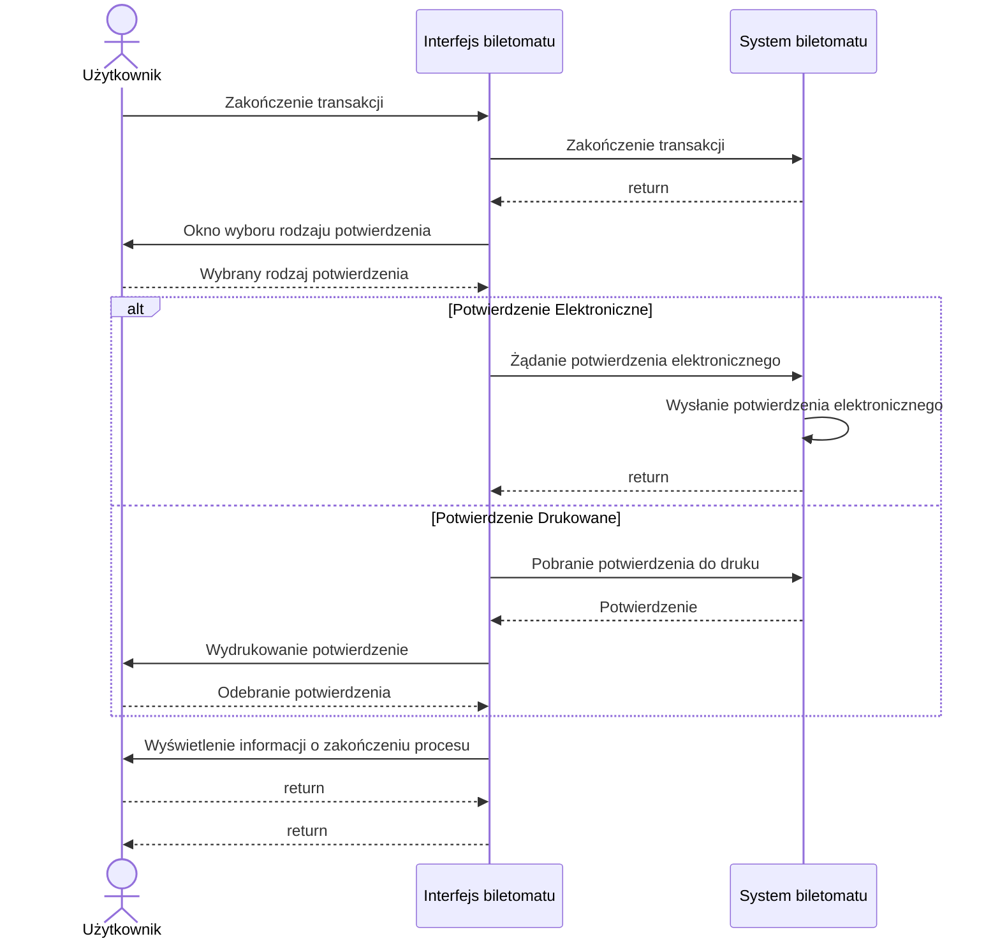

# User Stories

1. **Jako użytkownik**, chcę szybko wybrać rodzaj biletu, aby zminimalizować czas spędzony przy biletomacie.
1. **Jako użytkownik**, chcę mieć możliwość wyboru języka, aby móc korzystać z biletomatu bez względu na znajomość języka lokalnego.
1. **Jako użytkownik**, chcę sprawdzić poprawność transakcji przed jej finalizacją, aby uniknąć pomyłek.
1. **Jako użytkownik**, chcę otrzymać potwierdzenie zakupu (np. wydruk biletu lub elektroniczny bilet), aby móc korzystać z transportu zgodnie z przepisami.
1. **Jako użytkownik**, chcę płacić za bilet kartą, gotówką lub telefonem, aby mieć większą elastyczność w wyborze metody płatności.
2. **Jako użytkownik**, chcę otrzymać wyraźne instrukcje na ekranie, aby wiedzieć, jak dokonać zakupu krok po kroku.
3. **Jako użytkownik**, chcę widzieć czas pozostały na decyzję (np. wyświetlany 
licznik czasu), aby móc szybko podjąć działanie.

# Diagramy przypadków użycia

## 1. Szybki wybór rodzaju biletu

## 2. Wybór języka

## 3. Sprawdzenie poprawności transakcji

## 4. Otrzymanie potwierdzenia zakupu

### Wspólny diagram przypadków użycia

# Diagramy sekwencji

## Diagram sekwencji dla przypadku użycia wybrania języka

- Aktor: Użytkownik
- Obiekty: Interfejs biletomatu, System biletomatu
- Kolejność komunikatów:
  1. Użytkownik klika w dowolne miejsce na interfejsie biletomatu
  2. Interfejs biletomatu pobiera dostępne języki z systemu
  3. Interfejs biletomatu wyświetla ekran powitalny z opcjami wyboru języka
  4. Użytkownik wybiera preferowany język
  5. System biletomatu dostosowuje interfejs do wybranego języka
  6. Interfejs biletomatu wyświetla dostosowany interfejs
- Scenariusz alternatywny 1 (Lista popularnych języków)
  1. Użytkownik klika w dowolne miejsce na interfejsie biletomatu
  2. Interfejs biletomatu pobiera dostępne języki z systemu
  3. Interfejs biletomatu wyświetla ekran powitalny z opcjami wyboru języka
  4. Użytkownik wciska przycisk popularnych języków
  5. Interfejs wyświetla listę popularnych języków
  6. Użytkownik wybiera preferowany język
  7. System biletomatu dostosowuje interfejs do wybranego języka
  8. Interfejs biletomatu wyświetla dostosowany interfejs
 
## Wizualizacja diagramu sekwencji

## Diagram sekwencji dla przypadku użycia Otrzymanie potwierdzenia zakupu

- Aktor: Użytkownik
- Obiekty: Interfejs biletomatu, System biletomatu
- Kolejność komunikatów:
  1. Użytkownik kończy transakcję
  1. System generuje potwierdzenie
  2. Interfejs wyświetla okno wyboru rodzaju potwierdzenia
  3. Użytkownik wybiera potwierdzenie elektroniczne
  4. Interfejs wysyła informację o potwierdzeniu elektronicznym
  5. System wysyła potwierdzenie elektroniczne użytkownikowi
  6. Interfejs wyświetla informację o zakończeniu procesu
- Scenariusz alternatywny 1 (Wybór potwierdzenia drukowanego)
  1. Użytkownik kończy transakcję
  1. System generuje potwierdzenie
  2. Interfejs wyświetla okno wyboru rodzaju potwierdzenia
  3. Użytkownik wybiera potwierdzenie drukowane
  4. Interfejs wysyła informację o potwierdzeniu drukowanym
  5. System wysyła potwierdzenie do intefejsu
  6. Interfejs drukuje potwierdzenie
  7. Użytkownik odbiera potiwerdzenie
  8. Interfejs wyświetla informację o zakończeniu procesu

## Wizualizacja diagramu sekwencji

